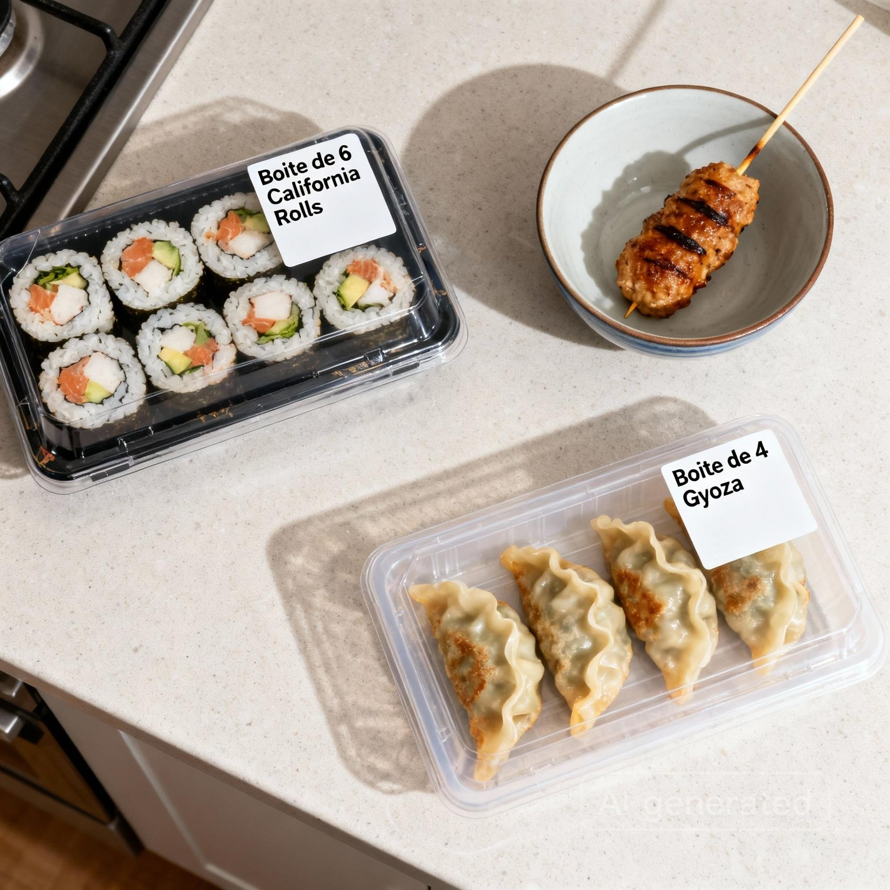

<div align="center">

# Celeste Staff Meal


**Plateforme de Vérification de Commandes UberEats / Deliveroo**

Vérifiez chaque commande avant de fermer le sac pour éviter les erreurs de préparation.

[](https://www.python.org/)
[](LICENSE)
[](https://supabase.com)
[]()
[]()

[Installation](#-installation) • [Fonctionnalités](#-fonctionnalités-clés) • [Architecture](#-architecture) • [Documentation](#-documentation) • [Tests](#-tests--qualité) • [Contribuer](#-contribuer)

</div>

---

## 🎯 Objectif

Éviter les erreurs de préparation en vérifiant chaque commande avant de fermer le sac. Zéro article manquant, moins de réclamations, meilleures notes sur les plateformes de livraison.

<div align="center">

### 🚀 [**Accéder à l'Application →**](https://celeste-staff-meal.streamlit.app/)

<a href="https://celeste-staff-meal.streamlit.app/">
  
</a>

**[https://celeste-staff-meal.streamlit.app/](https://celeste-staff-meal.streamlit.app/)**

</div>

<div align="center">
  
  
  <br>
  <em>Scan du QR Code → Analyse de la photo du sac → Validation</em>
</div>

---

## 🤝 Propulsé Par

<div align="center">


**Construit avec [Celeste AI](https://github.com/withceleste/celeste-python) • Toutes les capacités. Tous les fournisseurs. Une interface.**

</div>

---

## ✨ Fonctionnalités Clés

### 🚀 Entièrement Déployé et Fonctionnel

Solution prête pour la production avec interface utilisateur complète, intégration de base de données et capacités IA. Prêt à l'emploi immédiatement après la configuration.

### 🤖 4 AI Capabilities

Alimenté par **Celeste AI** avec quatre capabilities distinctes :

- **🖼️ Image Intelligence** : Détection visuelle des commandes à partir de photos du sac utilisant la vision par ordinateur avancée
- **📝 Text Generation** : Explications alimentées par l'IA et insights intelligents pour le tableau de bord
- **🔊 Speech Generation** : Explications audio en plusieurs langues pour l'accessibilité
- **🎨 Image Generation** : Mode démo pour les tests et l'entraînement sans commandes réelles

### 🌍 Fonctionnalités Inclusives

**Support Multi-langues** (20+ langues) :
🇫🇷 Français • 🇬🇧 Anglais • 🇪🇸 Espagnol • 🇸🇦 Arabe • 🇸🇳 Wolof • 🇲🇱 Bambara • 🇨🇳 Chinois Mandarin • 🇻🇳 Vietnamien • 🇵🇹 Portugais • 🇷🇴 Roumain • ⵣ Berbère/Tamazight • 🇨🇩 Lingala • 🇰🇪 Swahili • 🇭🇰 Cantonais • 🇹🇷 Turc • 🇮🇹 Italien • 🇵🇱 Polonais • 🇮🇳 Hindi • 🇳🇬 Fula/Fulani • 🇳🇬 Hausa • 🇰🇭 Khmer • 🇵🇰 Ourdou • 🇧🇩 Bengali • 🇵🇭 Tagalog • 🇮🇳 Tamoul

**🔊 Explications Audio** : Résultats de validation en synthèse vocale pour une utilisation mains libres et l'accessibilité

###  Intégration Supabase

Persistance de données en temps réel avec Supabase :
- Stockage des enregistrements de validation
- Suivi de l'historique des commandes
- Données du tableau de bord analytique
- Infrastructure cloud scalable

### 🔑 Utilisez Vos Propres Clés API

Configurez les clés API par capacité directement dans la barre latérale de l'interface :
- Gestion des clés par capacité
- Support de plusieurs fournisseurs IA (Google, OpenAI, etc.)
- Aucune credential codée en dur
- Changement facile entre les fournisseurs

### 📊 Tableau de Bord Avancé

- **Métriques en Temps Réel** : Tendances et comparaisons de périodes
- **Visualisations Interactives** : Graphiques et diagrammes Plotly
- **Recommandations IA** : Insights et alertes automatiques
- **Filtrage Avancé** : Par opérateur, source, type d'erreur
- **Export de Données** : CSV et Excel avec données enrichies

---

## 🏗️ Architecture

### Décomposition des Composants

**Couche UI (Streamlit)**
- Interface utilisateur pour la validation des commandes
- Tableau de bord pour les analyses et insights
- Barre latérale de configuration pour les paramètres IA
- Design responsive pour les environnements de cuisine

**Couche Service**
- Logique de validation des commandes
- Services de prédiction IA
- Génération d'explications
- Calcul des statistiques
- Détection d'alertes

**Couche Stockage (Supabase)**
- Persistance des enregistrements de validation
- Gestion de l'historique des commandes
- Requêtes de données en temps réel
- Agrégation de données analytiques

**Intégration IA (Celeste AI)**
- Intelligence d'image pour la détection des commandes
- Génération de texte pour les explications
- Génération de parole pour l'audio
- Génération d'image pour les démos

### Flux de Données

```
1. Scan QR Code → Extraction de Commande
2. Upload Image du Sac → Prédiction IA
3. Comparaison de Commande → Résultat de Validation
4. Génération d'Explication → Texte Multi-langues + Audio
5. Stockage du Résultat → Base de Données Supabase
6. Tableau de Bord Analytique → Insights en Temps Réel
```

### Pile Technologique

- **Python 3.12+** : Python moderne avec annotations de type
- **Streamlit** : Framework d'interface web interactive
- **Celeste AI** : Intégration IA multi-capacités
- **Supabase** : Base de données PostgreSQL avec fonctionnalités temps réel
- **Plotly** : Visualisations de données interactives
- **Pydantic** : Validation et sérialisation de données
- **Pillow** : Traitement d'images
- **Pandas** : Analyse et manipulation de données
- **QRCode** : Génération et scan de codes QR

---

## 🚀 Installation

### Prérequis

- Python 3.12 ou supérieur
- Gestionnaire de paquets [UV](https://github.com/astral-sh/uv)
- Compte Supabase (niveau gratuit disponible)
- Clés API des fournisseurs IA (Google/OpenAI/etc. - optionnel, peut être configuré dans l'UI)

### Configuration Étape par Étape

1. **Cloner le dépôt**
```bash
git clone https://github.com/Kamilbenkirane/celeste-staff-meal.git
cd celeste-staff-meal
```

2. **Installer les dépendances**
```bash
make sync
```

3. **Configurer les variables d'environnement**

Créez un fichier `.env` à la racine du projet :

```bash
# Configuration Supabase (Requis)
SUPABASE_URL=your_supabase_project_url
SUPABASE_KEY=your_supabase_anon_key

# Clés API des Fournisseurs IA (Optionnel - peut être configuré dans l'UI)
GOOGLE_API_KEY=your_google_api_key
OPENAI_API_KEY=your_openai_api_key
```

**Note** : Les clés API peuvent également être configurées directement dans la barre latérale de l'application UI, donc les variables d'environnement sont optionnelles pour les fournisseurs IA.

4. **Configurer Supabase**

Exécutez les migrations dans `supabase/migrations/` pour créer les tables requises :
- Table `validation_records`
- Table `orders`

Vous pouvez utiliser Supabase CLI ou l'interface web pour appliquer les migrations.

### Exécution

**Démarrer l'application :**

```bash
uv run streamlit run app.py
```

L'application sera disponible sur `http://localhost:8501`

---

## 🛠️ Technologies Utilisées

| Catégorie | Technologie | Objectif |
|----------|-----------|---------|
| **Langage** | Python 3.12+ | Langage de programmation principal |
| **Framework UI** | Streamlit | Interface web interactive |
| **Plateforme IA** | Celeste AI | Intégration IA multi-capacités |
| **Base de Données** | Supabase | Base de données PostgreSQL avec fonctionnalités temps réel |
| **Visualisation** | Plotly | Graphiques et diagrammes interactifs |
| **Validation de Données** | Pydantic | Modèles de données type-safe |
| **Traitement d'Images** | Pillow | Manipulation et traitement d'images |
| **Analyse de Données** | Pandas | Manipulation et analyse de données |
| **Codes QR** | QRCode + zxing-cpp | Génération et scan de codes QR |
| **Export Excel** | openpyxl | Génération de fichiers Excel |
| **Gestionnaire de Paquets** | UV | Gestion rapide de paquets Python |

---

## 📋 Fonctionnalités Supplémentaires

- **Lecture de Commandes** : OCR depuis le ticket ou intégration UberEats/Deliveroo
- **Analyse Visuelle** : Détection des articles dans le sac (boîtes, boissons, sauces)
- **Validation** : Écran clair "Manquant / OK" avec liste des articles manquants
- **Tableau de Bord Statistiques** :
  - Métriques avec tendances et comparaisons de périodes
  - Visualisations interactives (graphiques Plotly)
  - Analyse par opérateur et par source (UberEats/Deliveroo)
  - Recommandations automatiques alimentées par l'IA
  - Système d'alertes pour la détection d'anomalies
  - Filtres avancés (opérateur, source, type d'erreur)
  - Export CSV et Excel avec données enrichies
- **Générateur de QR Code** : Mode démo pour les tests sans commandes réelles

---

## 🎁 Avantages

- ✅ Réduction des réclamations "article manquant"
- ✅ Meilleures notes sur UberEats / Deliveroo
- ✅ Moins de stress à l'expédition
- ✅ Traçabilité complète
- ✅ Support multi-langues pour des équipes diversifiées
- ✅ Retour audio pour une utilisation mains libres
- ✅ Analyses et insights en temps réel

---

## ⚙️ Contraintes

- Vérification en moins de 5 secondes
- Interface utilisable avec les mains sales (grands boutons, texte minimal)
- Compatible avec smartphone/tablette simple
- Aucune configuration compliquée
- Fonctionne hors ligne pour la validation de base (nécessite internet pour les fonctionnalités IA)

---

## 🧪 Développement

```bash
make test      # Exécuter les tests
make lint      # Exécuter le linting
make format    # Formater le code
make typecheck # Exécuter la vérification de types
make ci        # Exécuter le pipeline CI complet
make security  # Scan de sécurité
```

---

## 🧪 Tests & Qualité

### Couverture de Tests

**99,57% de couverture de code** - Suite de tests complète garantissant la fiabilité et la qualité.

```bash
make test  # Exécuter les tests avec rapport de couverture
```

**Répartition de la Couverture :**
- ✅ `staff_meal/__init__.py` : 100%
- ✅ `staff_meal/database.py` : 100%
- ✅ `staff_meal/models.py` : 100%
- ✅ `staff_meal/order_storage.py` : 100%
- ✅ `staff_meal/qr.py` : 100%
- ✅ `staff_meal/storage.py` : 98%

**90 tests unitaires** couvrant toutes les fonctionnalités principales incluant :
- Opérations de base de données et intégration Supabase
- Logique de validation et comparaison des commandes
- Génération et décodage de codes QR
- Services de prédiction et d'explication IA
- Modèles de données et sérialisation
- Analyses et insights du tableau de bord

Tous les tests passent avec **exigence minimale de couverture de 80%** appliquée.

---

## 📚 Documentation

Documentation complète disponible dans le dossier `docs/` :

- **[Architecture du système](docs/architecture.md)** : Diagrammes d'architecture, flux de données, composants et séquences
- **[Guide utilisateur Dashboard](docs/dashboard-guide.md)** : Guide complet pour utiliser le tableau de bord analytique
- **[Cas d'usage avancés](docs/use-cases.md)** : Scénarios détaillés et cas d'usage réels (validation quotidienne, analyse de performances, formation, intégrations, multi-restaurants)

### Documentation pour développeurs

- **[Guide de contribution](CONTRIBUTING.md)** : Standards de code, processus de développement, tests et pull requests
- **[Standards de développement](AGENTS.md)** : Guidelines techniques détaillées pour le développement

---

## 🤝 Contribuer

Les contributions sont les bienvenues ! Veuillez consulter le [Guide de contribution](CONTRIBUTING.md) pour :

- Standards de code et conventions
- Processus de développement local
- Guide des tests (couverture minimale 80%)
- Processus de Pull Request

**Types de contributions** :
- 🐛 Rapports de bugs
- 💡 Suggestions de fonctionnalités
- 📝 Amélioration de la documentation
- 🔧 Code (corrections et nouvelles fonctionnalités)
- 🧪 Tests

---

## 📄 Licence

Licence Apache 2.0 – voir [LICENSE](LICENSE) pour les détails.

---

<div align="center">

Fait avec ❤️ pour les restaurants

</div>
