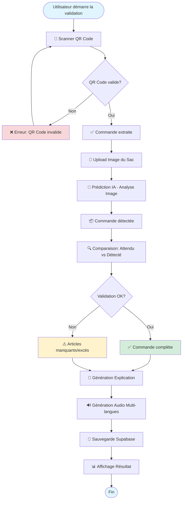
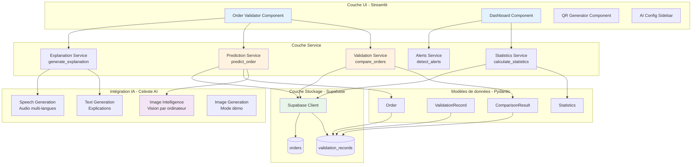
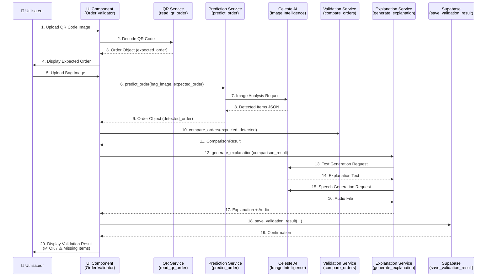
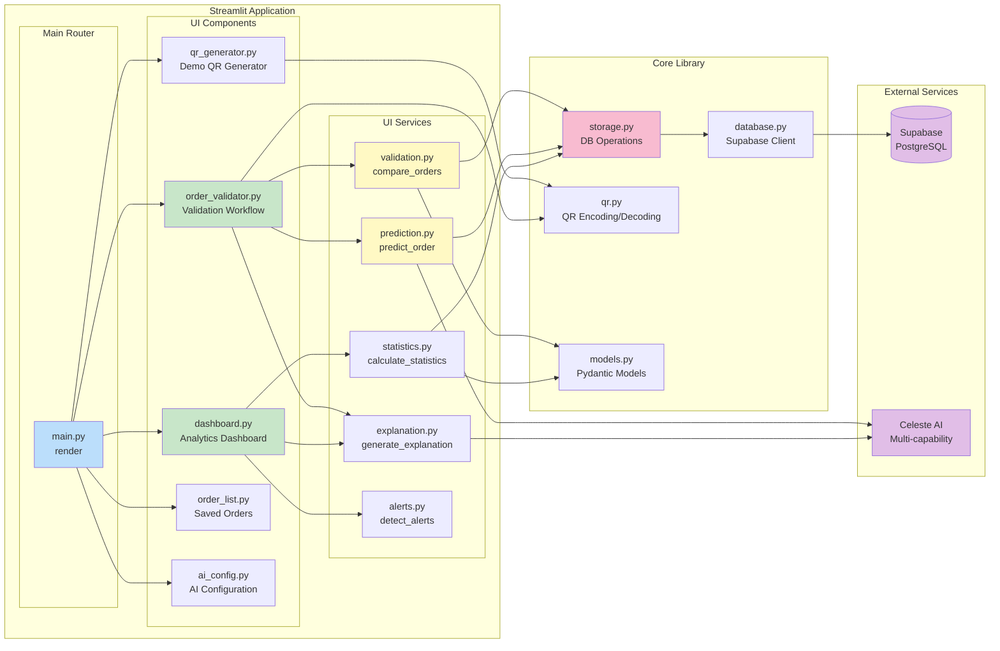
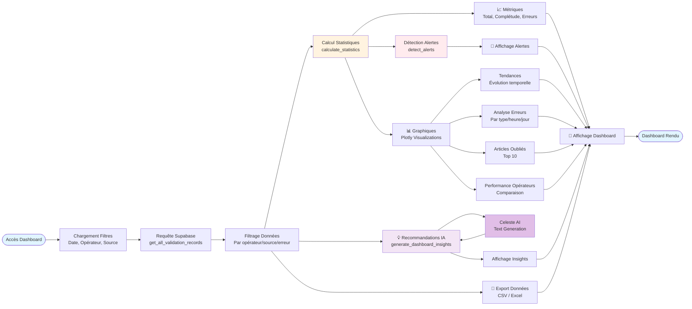

# Architecture du Système

Ce document décrit l'architecture technique de Celeste Staff Meal, incluant les diagrammes de flux de données, l'architecture système, les séquences d'interaction et les composants.

## Table des matières

- [Flux de données principal](#flux-de-données-principal)
- [Architecture système](#architecture-système)
- [Diagramme de séquence - Validation](#diagramme-de-séquence---validation)
- [Diagramme de composants](#diagramme-de-composants)
- [Flux de données - Dashboard](#flux-de-données---dashboard)

---

## Flux de données principal

Ce diagramme illustre le workflow complet de validation d'une commande, depuis le scan du QR code jusqu'à l'enregistrement du résultat.

---

## Architecture système

Ce diagramme montre la décomposition en couches de l'application et les interactions entre les différentes couches.

---

## Diagramme de séquence - Validation

Ce diagramme détaille les interactions entre les composants lors du processus de validation d'une commande.

---

## Diagramme de composants

Ce diagramme montre les composants UI et leurs interactions avec les services backend.

---

## Flux de données - Dashboard

Ce diagramme illustre le flux de données pour le tableau de bord analytique.

---

## Technologies et dépendances

### Stack technique

- **Langage** : Python 3.12+ avec type hints complets
- **Framework UI** : Streamlit pour l'interface web interactive
- **IA** : Celeste AI pour les capacités multi-modales
- **Base de données** : Supabase (PostgreSQL) pour la persistance
- **Visualisation** : Plotly pour les graphiques interactifs
- **Validation** : Pydantic pour la validation de données type-safe
- **Traitement d'images** : Pillow (PIL) pour la manipulation d'images
- **Codes QR** : qrcode + zxing-cpp pour l'encodage/décodage

### Flux de données clés

1. **Validation** : QR Code → Image → IA → Comparaison → DB
2. **Dashboard** : DB → Filtrage → Statistiques → Visualisations → Export
3. **Explications** : Résultat → IA Text → IA Speech → Affichage

### Points d'intégration

- **Supabase** : Client singleton pour toutes les opérations DB
- **Celeste AI** : Configuration par capacité (Image, Text, Speech)
- **Streamlit** : Session state pour la gestion de l'état UI

---

## Notes d'architecture

### Principes de conception

1. **Séparation des responsabilités** : UI, Services, Stockage clairement séparés
2. **Type safety** : Pydantic models pour validation runtime + type hints pour validation statique
3. **Async-first** : Services async avec wrapper sync pour Streamlit
4. **Configuration flexible** : Clés API configurables via UI ou env vars
5. **Testabilité** : Services isolés et mockables pour tests unitaires

### Patterns utilisés

- **Singleton** : Supabase client (une instance globale)
- **Service Layer** : Logique métier dans `ui/services/`
- **Repository Pattern** : `storage.py` abstrait l'accès DB
- **Factory Pattern** : `create_client()` pour Celeste AI
- **Strategy Pattern** : Multi-providers IA (Google, OpenAI, etc.)

### Scalabilité

- **Stateless UI** : Streamlit session state pour état temporaire
- **Database** : Supabase scalable avec PostgreSQL
- **Caching** : Streamlit `@st.cache_data` pour optimiser les requêtes
- **Async** : Opérations IA non-bloquantes
